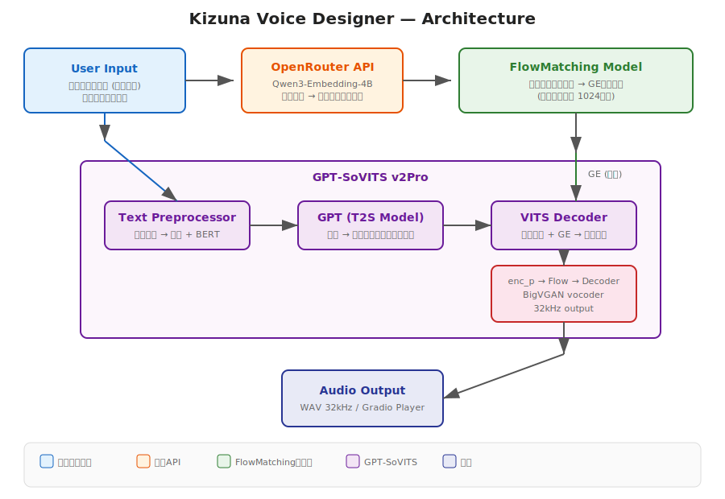

# Kizuna Voice Designer

> **v0.1.0-beta** — 本ソフトウェアは現在ベータ版です。声質生成の品質やAPIの仕様は今後変更される可能性があります。生成結果にはランダム性があり、思い通りの声質が出るまで何度かガチャを回す必要がある場合もあります。気長にお付き合いいただけると嬉しいです。フィードバックもぜひお寄せください。

テキストプロンプトから声質を生成するPythonライブラリ。FlowMatching + GPT-SoVITS ベース。

```python
from kizuna_voice_designer import VoiceDesigner

vd = VoiceDesigner(device="cuda:0")
audio, sr, embedding = vd.generate(
    prompt="30代前半の女性 落ち着きのある透明感ボイスで\n高級ホテルのコンシェルジュ",
    text="こちらのお席でよろしければ、すぐにお飲み物をご用意いたします。",
)
vd.save("output.wav", audio, sr)
vd.save_embedding("my_voice.npy", embedding)  # 声質を保存

# 同じ声で別のテキストを生成
audio2, sr, _ = vd.generate(prompt="", text="別のセリフです。", embedding=embedding)
```

## 目次

- [アーキテクチャ](#アーキテクチャ)
- [特徴](#特徴)
- [動作要件](#動作要件)
- [デモ音声](#デモ音声)
- [インストール](#インストール)
- [使い方](#使い方)
- [プロンプトの書き方](#プロンプトの書き方)
- [プロジェクト構成](#プロジェクト構成)
- [免責事項](#免責事項)
- [ライセンス](#ライセンス)

## アーキテクチャ



**処理フロー:**

1. **テキストプロンプト** → Qwen3-Embedding-4B（ローカル or OpenRouter API）でテキスト埋め込みベクトルに変換
2. **FlowMatching Model** → テキスト埋め込みから声質ベクトル (GE, 1024次元) を生成
3. **GPT-SoVITS v2Pro** → 読み上げテキストを音素化し、GPT (T2S) でセマンティックトークン生成
4. **VITS Decoder** → セマンティックトークン + 声質ベクトルから32kHz音声波形を合成

## 特徴

- **Pythonライブラリ** として `import` して使える
- 日本語テキストプロンプトで声質を指定（60種類以上のプリセット）
- Embedding モード切替（ローカルQwenモデル / OpenRouter API）
- Gradio Web UI も同梱

## 動作要件

- Python 3.10+
- GPU（推奨VRAM 8GB以上）

### 対応プラットフォーム

| OS | GPU | 状態 |
|----|-----|------|
| Linux | NVIDIA (CUDA) | 動作確認済み |
| Linux | AMD (ROCm) | 対応（要ROCm版PyTorch） |
| Windows | NVIDIA (CUDA) | 対応（setup.ps1 同梱） |
| Windows | AMD (ROCm) | 対応（要ROCm版PyTorch） |
| macOS | CPU | 動作するが低速 |
- テキスト埋め込みモードは3種類から選択:

| モード | 引数 | 追加VRAM | 備考 |
|--------|------|---------|------|
| **API** | `embedding_mode="api"` | なし | OpenRouter APIキーが必要。最高品質 |
| **ローカル** | `embedding_mode="local"` | 約8GB | transformersでフルモデルをロード。APIと同等品質 |
| **ローカル軽量** | `embedding_mode="local_lightweight"` | 約4GB | GGUF Q8量子化。APIキー不要で軽量だが、量子化により品質がやや低下する可能性あり |

## デモ音声

各リンクをクリックするとGitHub上で再生できます。

| キャラクター | プロンプト | 再生 |
|------------|---------|------|
| コンシェルジュ | 30代前半の女性 落ち着きのある透明感ボイス | [▶ 再生](docs/samples/コンシェルジュ.wav) |
| ツンデレ幼馴染 | 16歳の女の子 やや高めの澄んだ声でツンデレ調 | [▶ 再生](docs/samples/ツンデレ幼馴染.wav) |
| 朗読系ラジオDJ | 30代男性 深みのある低音、滑らかな語り | [▶ 再生](docs/samples/朗読系ラジオDJ.wav) |
| 穏やか教師 | 30代男性 落ち着いた中低音、ゆっくり丁寧語 | [▶ 再生](docs/samples/穏やか教師.wav) |
| おっとり青年店員 | 20代男性 柔らかい中音、マイペース丁寧語 | [▶ 再生](docs/samples/おっとり青年店員.wav) |

## インストール

1行でインストールできます。GPU環境に合わせてコマンドを選んでください。

```bash
# NVIDIA GPU (CUDA)
pip install "kizuna-voice-designer @ git+https://github.com/kizuna-intelligence/kizuna-voice-designer.git" --extra-index-url https://download.pytorch.org/whl/cu124

# AMD GPU (ROCm)
pip install "kizuna-voice-designer @ git+https://github.com/kizuna-intelligence/kizuna-voice-designer.git" --extra-index-url https://download.pytorch.org/whl/rocm6.2

# CPU のみ
pip install "kizuna-voice-designer @ git+https://github.com/kizuna-intelligence/kizuna-voice-designer.git" --extra-index-url https://download.pytorch.org/whl/cpu
```

**これだけで完了です。** git clone不要、手動ダウンロード不要。GPT-SoVITSのコードとモデルは初回実行時に `~/.cache/kizuna-voice-designer/` に自動ダウンロードされます。

### 動作確認

```python
from kizuna_voice_designer import VoiceDesigner

vd = VoiceDesigner(device="cuda:0")
audio, sr, embedding = vd.generate(
    prompt="30代前半の女性 落ち着きのある透明感ボイス",
    text="こんにちは、テスト音声です。",
)
vd.save("test.wav", audio, sr)
```

## 使い方

### Python ライブラリとして使う

```python
from kizuna_voice_designer import VoiceDesigner

# 初期化（デフォルト: GGUFモード、APIキー不要）
vd = VoiceDesigner(device="cuda:0")

# 音声生成（audio, sample_rate, embedding の3つが返る）
audio, sr, embedding = vd.generate(
    prompt="16歳の女の子 やや高めの澄んだ声で\n素直になれず早口で誤魔化すツンデレ調",
    text="べ、別に待ってたわけじゃないんだから！",
)

# 保存
vd.save("output.wav", audio, sr)
vd.save_embedding("voice.npy", embedding)  # 声質を保存して再利用可能
```

#### パラメータをカスタマイズ

```python
vd = VoiceDesigner(
    device="cuda:0",
    embedding_mode="local",      # "local" or "api"
    cfg_scale=5.0,               # 高いほどプロンプトに忠実
    num_steps=80,                # 多いほど高品質
    noise_scale=0.6,
)
```

#### APIモードで使う

```python
vd = VoiceDesigner(
    device="cuda:0",
    embedding_mode="api",
    openrouter_key="sk-or-v1-...",
)
```

その他のサンプルは [`examples/`](examples/) を参照。

### 推奨ワークフロー

本ツールで生成した声質は毎回ランダム性があるため、そのまま大量生成すると声質がブレます。以下の2つのワークフローを推奨します。

#### ワークフロー A: MioTTS + 外部TTSで学習する（高品質・安定）

1. **Kizuna Voice Designer で気に入った声質の音声を1つ生成**
2. **その音声を [MioTTS](https://github.com/Aratako/MioTTS-Inference) に参照音声として渡し、学習データセットを作成**
3. **[Style-Bert-VITS2](https://github.com/litagin02/Style-Bert-VITS2) または [Piper TTS+](https://github.com/ayutaz/piper-plus) で学習**

MioTTSは感情的な読み上げが得意なため、喜怒哀楽のバリエーションを含んだ学習データを作りやすいのが利点です。目安として、説明的な読み上げ100文 + 感情的な読み上げ100文の計200文程度で学習すると、そこそこ品質の良いモデルが作れました。

#### ワークフロー B: embeddingを保存して量産 → 外部TTSで学習（手軽）

1. **Kizuna Voice Designer で気に入った声質を生成し、embedding を保存**
2. **同じ embedding を使って複数のテキストを生成し、学習データセットを作成**
3. **[Style-Bert-VITS2](https://github.com/litagin02/Style-Bert-VITS2) または [Piper TTS+](https://github.com/ayutaz/piper-plus) で学習**

```python
vd = VoiceDesigner(device="cuda:0")

# 気に入った声を見つけたら embedding を保存
audio, sr, embedding = vd.generate(prompt="...", text="サンプル")
vd.save_embedding("my_voice.npy", embedding)

# 同じ声で学習データを量産
embedding = vd.load_embedding("my_voice.npy")
for text in ["セリフ1", "セリフ2", "セリフ3"]:
    audio, sr, _ = vd.generate(prompt="", text=text, embedding=embedding)
    vd.save(f"{text}.wav", audio, sr)
```

MioTTS不要で手軽ですが、ワークフローAと比べると音声のバリエーションは限定的です。いずれの場合も最終的にStyle-Bert-VITS2等で学習することで、安定した音声合成が可能になります。

### Gradio Web UI（おまけ）

```bash
python gradio_ref_free_flow_app.py

# シェアモード
SHARE=true python gradio_ref_free_flow_app.py
```

## プロンプトの書き方

音声プロンプトは **3行構成** で書くと最も効果的です。

### 基本フォーマット

```
[年齢・性別] [声質の特徴]
[話し方・トーン・テンポ]
[シチュエーション・キャラクター設定]
```

### 具体例

```
30代前半の女性 落ち着きのある透明感ボイスで
言葉の間に十分な余白を取りつつ丁寧に
高級ホテルのラウンジで客に寄り添うコンシェルジュ
```

```
16歳の女の子 やや高めの澄んだ声で
素直になれず早口で誤魔化すツンデレ調
放課後の帰り道で主人公に文句を言いつつ待っている幼馴染
```

```
30代男性 低音で静か、余裕を含む
ゆっくりとした丁寧語に皮肉
薄暗い部屋で脅す黒幕
```

### ヒント

| 要素 | 効果的な書き方 | 例 |
|------|-------------|-----|
| **声質** | 高低・質感・特徴を具体的に | 「低めハスキー」「透き通る高音」「か細く囁くような」 |
| **話し方** | テンポ・語尾・口調を指定 | 「早口で語尾強め」「ゆっくり丁寧語」「ぼそっと話す」 |
| **シチュエーション** | 場面と役割を設定 | 「カフェで接客する店員」「戦場で指揮を執る軍師」 |
| **年齢** | 声の若さに大きく影響 | 「10歳前後」「20代後半」「40代」 |
| **感情** | トーンの方向性 | 「気怠そうな」「テンション高めで」「冷静沈着な」 |

### 既知の制限

- **男性キャラクターの声質生成は現状弱いです。** 学習データに女性音声の比率が高いため、男性の声質は女性と比べてバリエーション・品質ともに劣る傾向があります。
- プロンプトは**日本語**で記述してください
- 1行だけでも動作しますが、3行構成の方がより細かく声質を制御できます
- 同じプロンプトでも生成ごとに異なる声質が生成されます（ランダム性あり）

## プロジェクト構成

```
kizuna-voice-designer/
├── kizuna_voice_designer/        # Pythonパッケージ
│   ├── __init__.py
│   ├── synthesizer.py            # VoiceDesigner クラス
│   └── app.py                    # Gradio UI エントリーポイント
├── examples/                     # サンプルプログラム
│   ├── basic_usage.py
│   ├── batch_generate.py
│   └── custom_params.py
├── synthesize_ref_free_flowmatching.py
├── synthesize_ref_free_flowmatching_cfg.py
├── gradio_ref_free_flow_app.py   # Gradio Web UI
├── GPT-SoVITS/                   # サブモジュール
├── models/                       # モデルファイル（要ダウンロード）
├── docs/architecture.svg
├── pyproject.toml
└── requirements.txt
```

## 免責事項

> 詳細は [LICENSE](LICENSE) ファイルを参照してください。以下はその要約です。

### 禁止事項

- **実在する声優・歌手・俳優など、特定の個人の声を意図的に模倣・複製する目的での使用を禁止します。** 本ツールはオリジナルの声質をテキストプロンプトから創造的に生成することを目的としており、既存の音声アイデンティティを侵害する行為に使用してはなりません。
- 詐欺、なりすまし、ディープフェイクなど、他者を欺く目的での使用を禁止します。
- 適用される法律および規制に違反する使用を禁止します。

### 学習データについて

- 本モデルの学習に使用した音声データは、日本国著作権法第30条の4（著作物に表現された思想又は感情の享受を目的としない利用）に基づき、機械学習のための情報解析として適法に利用しています。
- 学習データに含まれる音声は、特定の話者の声質を再現するためではなく、声質空間の汎化的な表現を獲得するために使用されています。

### 免責

- 本ソフトウェアによって生成された音声の利用に関して、開発者は一切の責任を負いません。生成音声の使用に伴うすべてのリスクはユーザーが負うものとします。
- 本ソフトウェアは研究・実験目的で提供されており、商用利用に関してはユーザー自身の責任で適用法令を確認してください。
- 本ソフトウェアが依存するサードパーティのモデル（GPT-SoVITS、Qwen3-Embedding 等）にはそれぞれ独自のライセンスが適用されます。利用にあたっては各ライセンスを確認してください。

## ライセンス

[Kizuna Community License v1.0](LICENSE)

MIT License の許諾条項をベースに、音声生成ツール特有の条項を追加した独自ライセンスです。厳密な OSI 準拠のオープンソースライセンスではありませんが、小規模事業者や個人の使いやすさ、開発の持続性、そしてオープンソースのあるべき姿を考慮した結果、このようなライセンス形態を採用しました。ソフトウェアの利用・改変・再配布は自由ですが、生成した音声データの扱いや商用利用に関して以下の追加条件があります。

- **クレジット表記あり** → 生成音声・ソフトウェア組み込み含め、**規模問わず自由に利用可能**
  - クレジット: `kizuna-intelligence` / `Kizuna Voice Designer`
- **クレジット表記なし** → 別途ライセンス契約が必要
- 特定個人の声の意図的な模倣・詐欺・ディープフェイク目的の使用は禁止

## クレジット

- [GPT-SoVITS](https://github.com/RVC-Boss/GPT-SoVITS) by RVC-Boss
